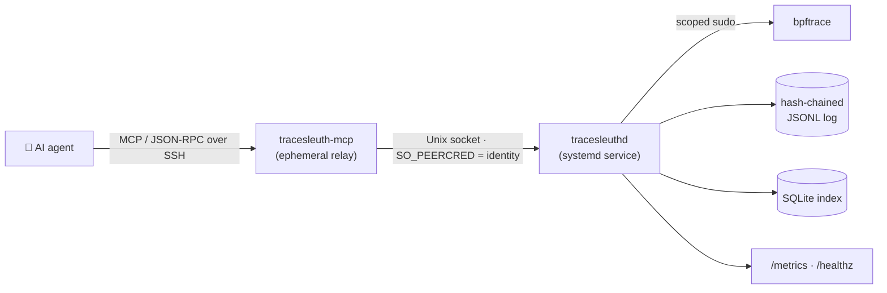
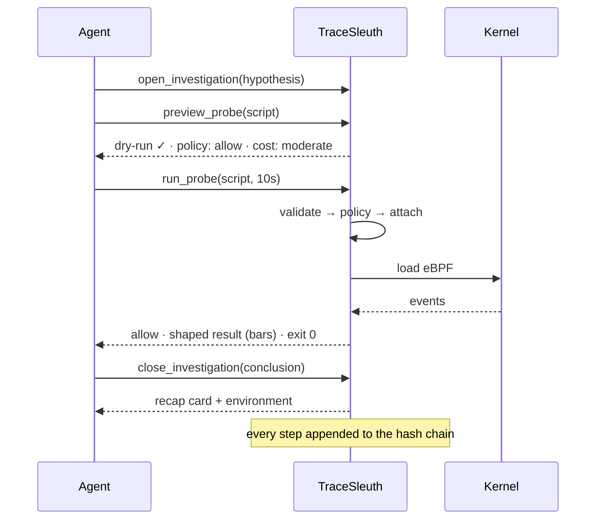

<div align="center">

<pre>
████████╗██████╗   █████╗   ██████╗███████╗
╚══██╔══╝██╔══██╗ ██╔══██╗ ██╔════╝██╔════╝
 ██║   ██████╔╝ ███████║ ██║     █████╗
 ██║   ██╔══██╗ ██╔══██║ ██║     ██╔══╝
   ██║   ██║  ██║ ██║  ██║ ╚██████╗███████╗
  ╚═╝   ╚═╝  ╚═╝ ╚═╝  ╚═╝  ╚═════╝ ╚══════╝
 ███████╗██╗     ███████╗██╗   ██╗████████╗██╗  ██╗
 ██╔════╝██║     ██╔════╝██║   ██║╚══██╔══╝██║  ██║
 ███████╗██║     █████╗  ██║   ██║   ██║   ███████║
 ╚════██║██║     ██╔══╝  ██║   ██║   ██║   ██╔══██║
 ███████║███████╗███████╗╚██████╔╝   ██║   ██║  ██║
 ╚══════╝╚══════╝╚══════╝ ╚═════╝    ╚═╝   ╚═╝  ╚═╝
</pre>

### Auditable, policy-gated eBPF investigations an AI agent can run — and a human can trust.

**Every probe is checked before it loads, recorded on a tamper-evident chain, and answerable months later.**

[](https://github.com/scale03/tracesleuth/actions)
[](https://go.dev)
[](LICENSE)
[](https://github.com/bpftrace/bpftrace)
[](docs/mcp.md)
[](CONTRIBUTING.md)

</div>

---

TraceSleuth lets an agent investigate a Linux host with real eBPF — "why is this
service stalling?", "who is deleting these files?", "what's retransmitting?" — and
guarantees that at **any point later** a human can answer, with zero ambiguity:

- 🔬 **What hypothesis** was being tested?
- 📜 **What exact bpftrace script** loaded, on which host, run by whom?
- 🛂 **What did policy decide**, and why?
- ⏱️ **What happened when it ran** — duration, exit code, output?


## Contents

- [Why](#why)
- [Features](#features)
- [How it works](#how-it-works)
- [Driving it from an agent](#driving-it-from-an-agent)
- [Deploy on a Linux host](#deploy-on-a-linux-host)
- [Security model](#security-model)
- [Observability](#observability)
- [Status & roadmap](#status--roadmap)
- [Contributing](#contributing)

## Why

Handing an AI agent a root shell and `bpftrace` is powerful and terrifying in
equal measure. bpftrace can read anything the kernel sees; an unbounded probe can
flood a box; and when something *did* run, there's usually no durable answer to
"what exactly, and who let it?"

TraceSleuth keeps the power and removes the terror:

- The agent never gets a shell and never runs bpftrace directly.
- Every script passes a **policy gate** — allow-list, duration caps, and an
  aggregation requirement on high-frequency probes — *before* it touches the
  kernel.
- Every decision and result lands on a **hash chain** you can verify with one
  command. Edit or delete a line and verification fails.

## Features

| | |
|---|---|
| 🛂 **Policy before kernel** | Rego/OPA-backed allow-list, duration limits, and mandatory aggregation on firehose probes — enforced before a probe loads, never after. |
| 🔗 **Tamper-evident audit** | Append-only hash-chained JSONL is the source of truth; `verify-chain` proves it's intact. The SQLite index is rebuildable. |
| 🤖 **MCP-native** | Purpose-built tool surface — `open`, `preview`, `run`, `close`, `discover` — so any MCP agent can drive it. Not a CLI wrapper. |
| 👁️ **Preview before you commit** | `preview_probe` returns the dry-run, the policy decision, and a cost estimate with **zero execution and zero chain writes** — approve first, run second. |
| 📇 **Identity from the transport** | Attribution is the caller's kernel-attested identity (SSH / `SO_PEERCRED`, mTLS coded). A client can't claim to be someone else. |
| 📊 **Aggregations, rendered** | `@maps` come back as bar charts, histograms pass through — the shaped result fits in a chat window instead of drowning it. |
| 🗺️ **Full Discovery** | A curated catalog of recommended attach points, plus live `bpftrace -l` for everything the host actually exposes. |
| 📈 **Prometheus built in** | The daemon exposes `/metrics` and `/healthz` out of the box. |
| 🧪 **Mock backend** | Exercise the entire flow — and the audit chain — on any machine, no Linux and no root. A mock result is recorded as such, never mistaken for a real capture. |

## How it works



The agent speaks MCP to an ephemeral relay; the relay forwards to a long-lived
daemon over a local Unix socket. The daemon owns the data, runs the policy gate,
elevates only to invoke bpftrace through a sudo rule scoped to that one binary,
and writes every step to the chain. Identity is the relay's kernel-attested uid —
the user the SSH session authenticated as.



## Driving it from an agent

The intended interface is MCP. A session looks like this — the agent proposes a
script, sees the decision and cost, then runs it:

```jsonc
// preview_probe → nothing runs, nothing is written
{
  "decision": "allow",
  "cost": { "event_rate": "moderate", "aggregated": true },
  "script": "tracepoint:syscalls:sys_enter_execve { @execs[str(args->filename)] = count(); }"
}
```

```text
// run_probe → allow · backend: bpftrace · exit 0

@execs (4)
  /bin/date        10  ██████████████████████████████
  /usr/bin/sleep   10  ██████████████████████████████
  /usr/bin/id       8  ████████████████████████
  /usr/bin/uptime   5  ███████████████
```

Closing the investigation returns a recap card — hypothesis, the environment it
ran on (kernel, distro, bpftrace version, BTF), each probe's finding, and the
conclusion. Full tool reference in [`docs/mcp.md`](docs/mcp.md).

## Deploy on a Linux host

```sh
sudo deploy/install.sh
```

Builds the binaries, creates a dedicated `tracesleuth` system user, installs the
hardened systemd unit and the scoped sudoers rule, and starts the service. Then
point an MCP client at the relay over SSH — copy [`.mcp.json.example`](.mcp.json.example)
and edit it for your host. Full walkthrough in [`deploy/README.md`](deploy/README.md).

The one privilege TraceSleuth needs, and the only thing elevated:

```
tracesleuth ALL=(root) NOPASSWD: /usr/bin/bpftrace
```

Kubernetes (DaemonSet + mTLS + Helm) is on the roadmap.

## Security model

- **Least privilege.** The daemon runs unprivileged. Only bpftrace is elevated,
  via sudo scoped to that exact binary — nothing else in the system gains root.
- **Policy is not advisory.** It runs before `probe_started`; a denied probe never
  reaches the kernel, and the denial is logged with an actionable reason.
- **Identity is attested, not claimed.** SSH session uid via `SO_PEERCRED` today,
  mTLS certificate identity coded for the Kubernetes path. Client-supplied
  identity is ignored.
- **The record resists its own operator.** The audit log is hash-chained; the
  party that runs an investigation cannot silently rewrite what it did.

See [`SECURITY.md`](SECURITY.md) for the full threat model.

## Observability

`/metrics` (Prometheus) and `/healthz` bind to `127.0.0.1:9464` by default:
investigations opened, decisions by outcome, a probe-duration histogram, and a
gauge of probes currently attached. Scrape locally, or bind wider behind your own
auth.

## Status & roadmap

Single-host core works and is driveable over MCP: investigations open, run
policy-gated probes, and close with a recap; the daemon owns the data and exposes
metrics. **Not yet built:** async baselines/diffs, Kubernetes deployment, and
cgroup resource guards. Honest phase-by-phase state lives in
[`docs/status.md`](docs/status.md); the architecture is in
[`docs/architecture.md`](docs/architecture.md).

## Contributing

Issues and PRs are welcome. `go test ./...` and `opa test ./policy/...` must be
green — the policy tests are safety-critical and required in CI. Read
[`CONTRIBUTING.md`](CONTRIBUTING.md) for the workflow and the house style.

## License

[Apache 2.0](LICENSE) © The TraceSleuth Authors.
